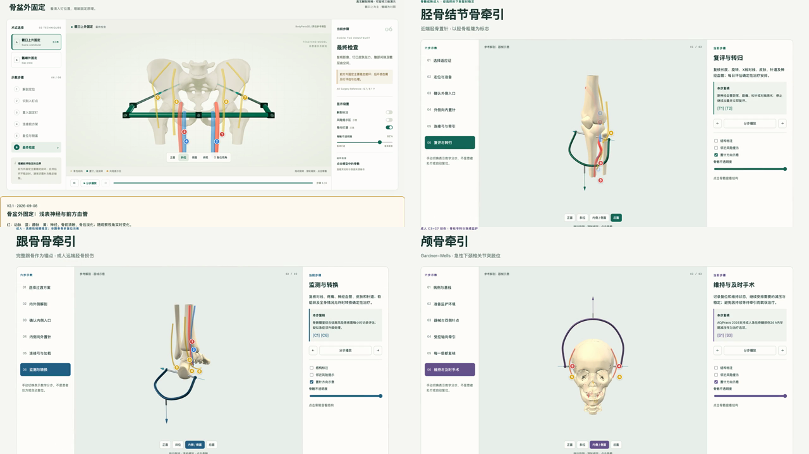

# Orthopaedic Trauma Atlas / 骨科创伤操作教学图谱

面向创伤骨科课堂演示、术前复习与技能训练的中英双语交互教学项目。主页以动态视频展示四个独立模块；模块内提供可旋转的参考解剖、分步操作、神经血管警示、操作参数与 4K 教学图。



## 在线访问

- [图谱主页](https://tuanziding.github.io/orthopaedic-trauma-atlas/)
- [骨盆外固定架](https://tuanziding.github.io/orthopaedic-trauma-atlas/neurovascular-v2/pelvic-external-fixation/)
- [胫骨结节骨牵引](https://tuanziding.github.io/orthopaedic-trauma-atlas/neurovascular-v2/tibial-traction/)
- [跟骨骨牵引](https://tuanziding.github.io/orthopaedic-trauma-atlas/neurovascular-v2/calcaneal-traction/)
- [颅骨牵引](https://tuanziding.github.io/orthopaedic-trauma-atlas/neurovascular-v2/cranial-traction/)

## 教学设计

- 动脉红、静脉蓝、神经黄；被骨遮挡的结构自动虚化，也可隐藏骨后结构。
- 每个模块提供中英文界面、风险结构说明、关键参数和分步操作。
- `neurovascular-v2/*/teaching-images/` 共含 20 张 3840 × 2160 教学图。
- 首页动态视频由四个现有教学模块的真实画面制作；静态预览图作为视频回退内容。

## 本地查看与重建

直接打开根目录 `index.html`，或运行：

```sh
npm ci
npm run serve
```

访问 `http://localhost:8080`。重建当前四个模块可运行 `npm run build`；旧版单一骨盆页面源码保留在 `src/`，如需生成归档版本可运行 `npm run build:legacy-pelvis`，输出到 `legacy/pelvic-external-fixation-v1/index.html`，不会覆盖图谱主页。

## 依据与边界

操作框架参考 AO Surgery Reference、AO Spine / Praxis、WFNS、AAOS 与 BOASt 等权威资源，各模块列出具体来源、访问日期和适用限制。解剖网格源于 [BodyParts3D](https://lifesciencedb.jp/bp3d/)，完整署名与许可见 [ATTRIBUTION.md](ATTRIBUTION.md) 与 [THIRD_PARTY_LICENSES.txt](THIRD_PARTY_LICENSES.txt)。

本项目为独立教学改编，不代表上述机构的官方制作、推荐或认证，也不替代规范培训、患者评估、个体影像、器械说明、影像引导或术者判断。资料核对日期：2026-09-08。
